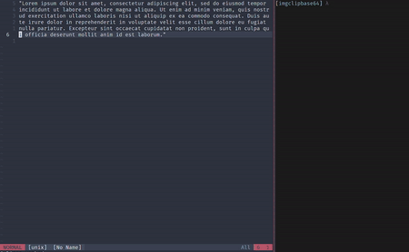

# Convert image in clipboard to markdown formatted base64 encoded string.

Uses [clipboard API](https://github.com/golang-design/clipboard) to grab image from clipboard.

Package installation

    go get -u https://github.com/pcrandall/mdclip

Install 64bit darwin

    curl -s https://api.github.com/repos/pcrandall/mdclip/releases/latest | grep "browser_download_url" | cut -d '"' -f 4 | grep darwin | wget -qi - --output-document=mdclip.tar.gz && tar -xf mdclip.tar.gz && rm mdclip.tar.gz

Install 64bit windows

    curl -s https://api.github.com/repos/pcrandall/mdclip/releases/latest | grep "browser_download_url" | cut -d '"' -f 4 | grep windows | grep amd64.zip$ | wget -qi - --output-document=mdclip.zip && unzip -o mdclip.zip && rm mdclip.zip

Install 32bit windows

    curl -s https://api.github.com/repos/pcrandall/mdclip/releases/latest | grep "browser_download_url" | cut -d '"' -f 4 | grep windows | grep 386.zip$ | wget -qi - --output-document=mdclip.zip && unzip -o mdclip.zip && rm mdclip.zip

Dependency

    macOS users: require Cgo, no dependency
    Linux users: require X11 dev package. For instance, install libx11-dev or xorg-dev or libX11-devel to access X window system.
    Windows users: no Cgo, no dependency

Screenshot

In general, when you need test your implementation regarding images, There are system level shortcuts to put screenshot image into your system clipboard:

    On macOS, use Ctrl+Shift+Cmd+4
    On Linux/Ubuntu, use Ctrl+Shift+PrintScreen
    On Windows, use Shift+Win+s
